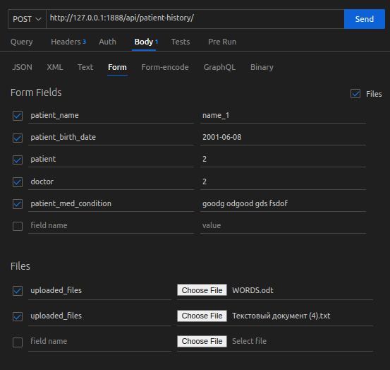

## Define the project components

1. Clone project.
    https://github.com/IFUITU/medhub/

2.  Create a new file called `.env` in your project directory and add the following content to the `.env` file.

   ```DEBUG=True
    ALLOWED_HOSTS=['*']
    SECRET_KEY=any_secret_key
    DATABASE_URL=psql://postgres:postgres@db/medhub
    POSTGRES_PASSWORD=postgres
    DB_NAME=medhub
    DB_PORT=5432
    POSTGRES_USER=postgres
   ```

3. Run this command `docker compose up -d --build`.
    - This installs used packages from `requirements.txt` file.
    - Creates and runs three containers. NGINX, OUR_DJANGO APPLICATION and POSTGRES.

5. Run  - `docker compose exec web python3 manage.py createsuperuser`.
    - To create superuser.

6. `http://127.0.0.1:1888/` access this host from browther.

## Get Auth Token 
1. First authenticate as Doctor user http://127.0.0.1:1888/user/ with following datas via POST method.
    ```
    {
    "username": "",
    "password": "",
    "confirm_pass": "",
    "user_type": "1"
    }
    ```
    user_type="" -> "1"=="Doctor", "2"=="Patient"

2. Login and get auth token http://127.0.0.1:1888/user/log/ via Following datas with POST method.
    ```
    {
        "username":"",
        "password":""
    }
    ```

## Uplaoding data with files for patient-history.

Only Doctors can upload Files or create new patient histories.

1. http://127.0.0.1:1888/api/patient-history/ 
    - send POST method with following data via POSTMAN or VsCode Thunder Client e.t.c.
    - 


## To run tests
1. Run `docker compose exec web python3 manage.py test`.
    - This command tests for accounts app and for main app!
